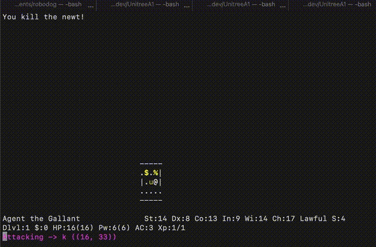

This repository contains [RAPH](https://www.aicrowd.com/challenges/neurips-2021-the-nethack-challenge/teams/raph) team solution for the [NetHack Challenge](https://nethackchallenge.com/), organized on NeurIPS 2021 competition track. This solution won the **first place** among neural net based solutions.

## Setup
```
pipenv install
```

## Run

run single evaluation with visual output
```
python3 playtest.py
```

evaluate 4096 episodes without visual output
```
python3 local_test.py
```

## Code structure

out agent: ```agents/torchbeast_agent.py```  
game state preprocessing, algorithms: ```nethack_raph/``` 

<p align="center">
  
</p>


